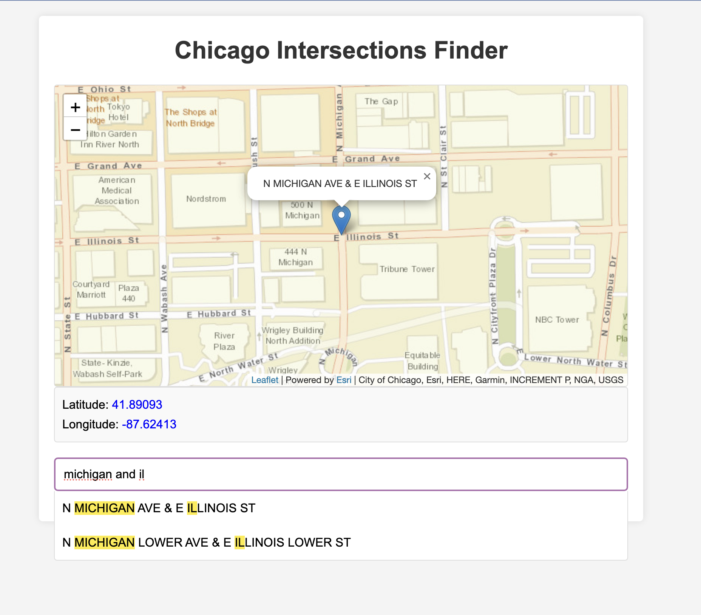

# Chicago Intersections using Street Center Line city data


### tl;dr: try the [interactive demo of this hacky-but-cloud-free Chicago streets geocoder](https://dannguyen.github.io/chicago-streets-static-geocoder/), built using public geospatial data</h3>

<a href="https://dannguyen.github.io/chicago-streets-static-geocoder/)">

</a>


## About / Why


I needed a way to geocode Chicago-area addresses/locations typed in by users, but without needing to sign up for a cloud service like [Google Maps Geocoding API](https://developers.google.com/maps/documentation/geocoding/overview).

Browsing Chicago's Data Portal, I found the [Street Center Lines](https://data.cityofchicago.org/Transportation/Street-Center-Lines/6imu-meau) dataset; **56,000+** records corresponding to each street segment, including the coordinates and street names for their starting and terminal intersections.

Using the script in [scripts/munge.py](scripts/munge.py), I've produced a simplified and (perhaps navively) deduped set of ~24,000 named intersections and their coordinates: [data/munged-chicago-intersections.csv](data/munged-chicago-intersections.csv).

You can see an even simpler web-reqdy version at [docs/static/chicago-intersections.json](docs/static/chicago-intersections.json); each record looks like this:

```json
{
    "intersection": "N ASHLAND AVE & N CLARK ST",
    "latitude": 41.99889,
    "longitude": -87.6709
}
```

As long as your user knows the names of Chicago streets near them, and you don't need house-level coordinates, this non-cloud locally-hosted solution might be useful for you.


Check out [the interactive demo](https://dannguyen.github.io/chicago-streets-static-geocoder/).


## Development notes

Run `npm install` to install the prettier linter.

Run `npm run munge` to run the data munging script (or just `python scripts/munge.py`)


## Random observations/notes

The city's data portal has a data manual included in a [deprecated version of the street center line data](https://data.cityofchicago.org/Transportation/Street-Center-Lines-Deprecated-July-2013-/xy4z-b6aa/about_data); I've stashed a copy of the PDF in this repo: [docs/static/chicagostreets-data-manual.pdf](chicagostreets-data-manual.pdf


- Each row seems to correspond to one segment, from F_CROSS to T_CROSS
- F_CROSS is the first coordinate pair in the_geom
- F_CROSS and T_CROSS both include the address numbers, not just the cross street
- STREETNAME, F_CROSS_ST, and T_CROSS_ST use the same identifier
  - So, build a look up table based on STREET_NAM and STREETNAME
- STREETNAME is unique for each pair of STREET_NAM and PRE_DIR
- ignore all street_ids that are either 1 or 0: they correspond to STREET_NAM = blank

